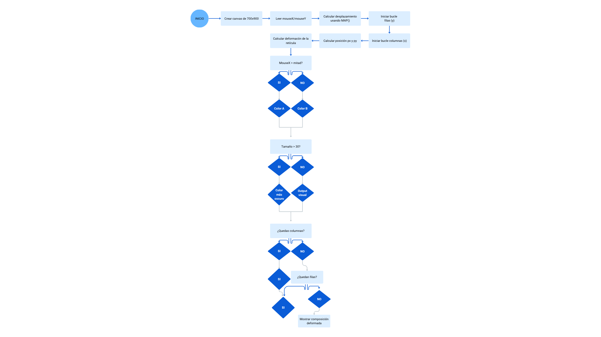
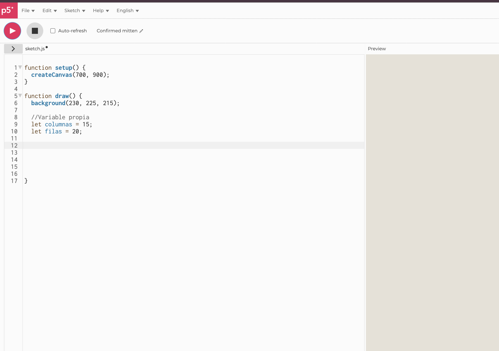
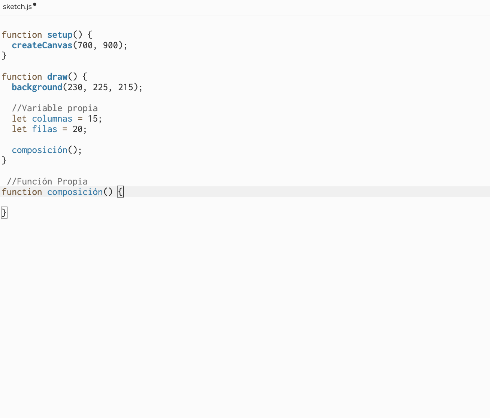
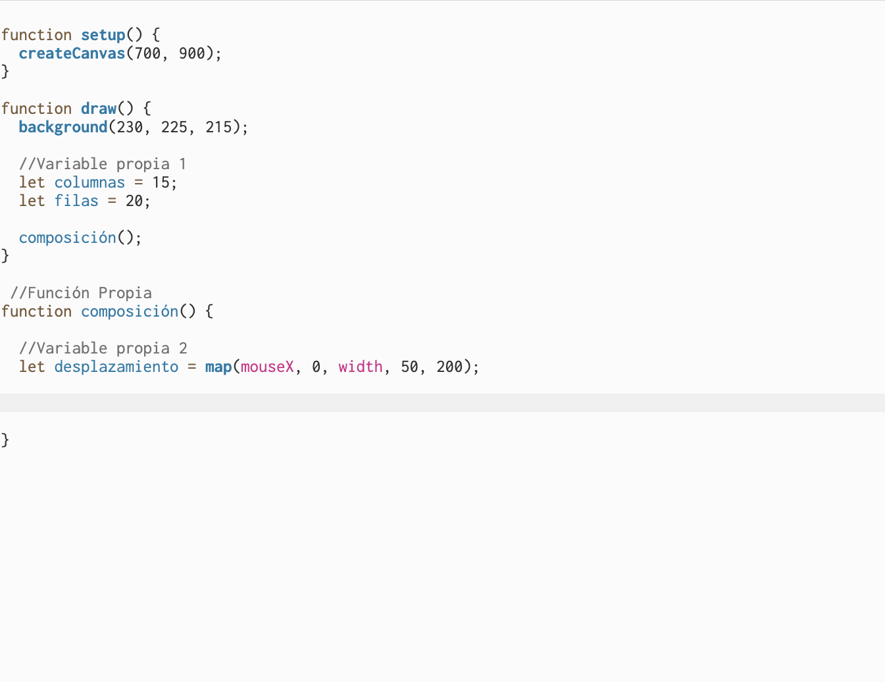
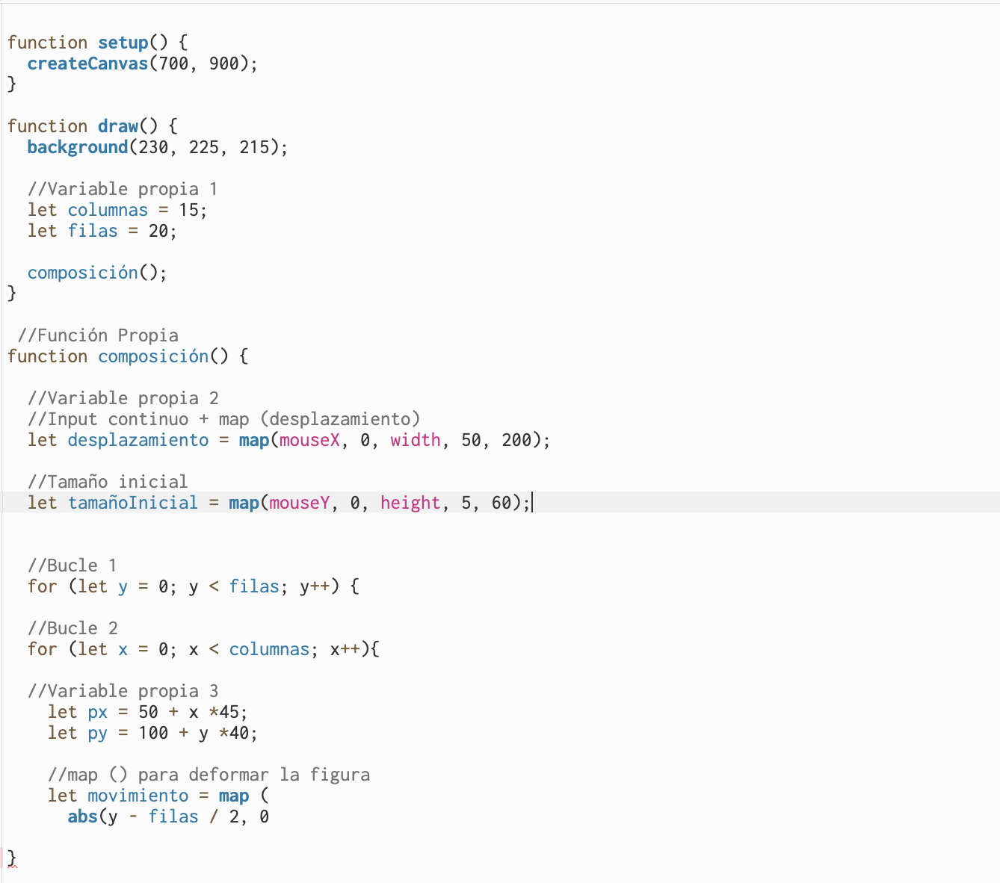
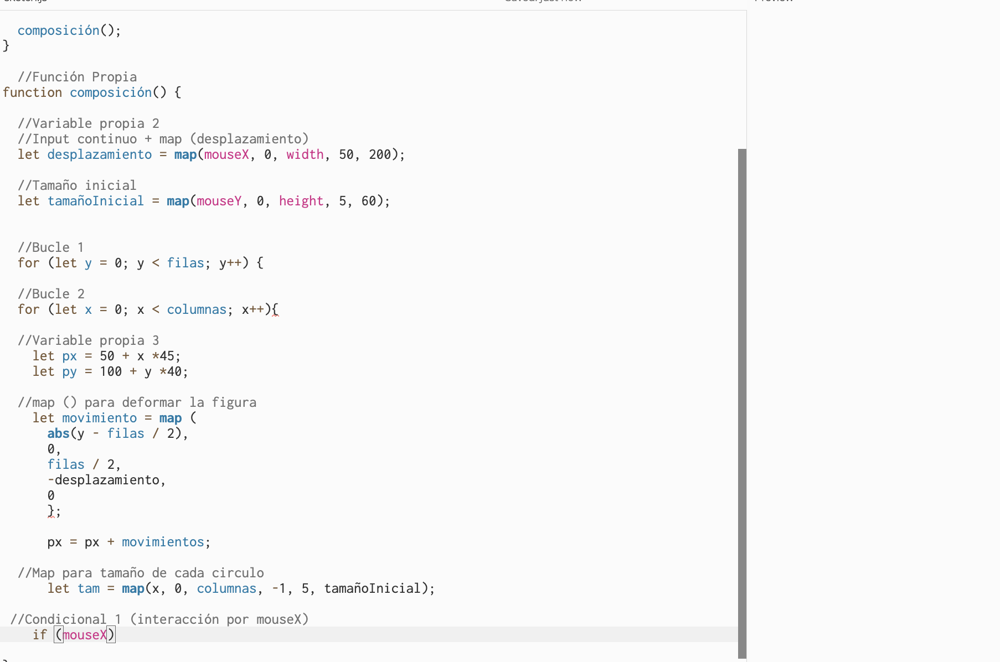

# Solemne ll

# Bauhaus Dots 1919

Estudiante: Catalina Meza

Aquí se puede acceder al proyecto y al código editable en p5.js:

[Link editable](https://editor.p5js.org/catalina.meza3/sketches/IqkQNjtyW)

[Archivo repositorio github](Solemne/sketch.js)

## Diagrama de flujo

## Documentación del proceso

Lo primero que hice fue construir una retícula simple de círculos para entender cómo distribuir los elementos dentro del espacio. En esta etapa el resultado era bastante estático, pero me permitió establecer una base sobre la cual seguir experimentando.

Después comencé a probar distintas formas de interacción utilizando la posición del mouse. Mi objetivo era que el usuario pudiera modificar la composición de manera intuitiva. Tras varias pruebas, decidí relacionar el movimiento del cursor con el tamaño y la deformación de los círculos para generar cambios visibles en tiempo real.

Finalmente realicé algunos ajustes en las proporciones, el movimiento y el comportamiento visual de los círculos. También ordené el código y agregué comentarios para que fuera más fácil de leer. El resultado es una composición interactiva que cambia constantemente según la posición del mouse y que explora la relación entre orden, repetición y variación.

## Información de la obra

Este cartel conmemorativo, que puedes ver en el archivo referente.webp, celebra los 100 años de la mítica escuela Bauhaus (1919-2019). Su diseño te atrapa con un juego visual de puntos negros que crecen y se curvan con un ritmo casi musical. En la parte superior, la tipografía es limpia y directa, fiel a esa idea tan de la escuela de que "menos es más". Con ese contraste tan marcado sobre el fondo beige, la obra logra resumir de un plumazo lo que siempre buscaron: unir el arte, la lógica y el diseño del día a día.

Aunque el cartel no lleva la firma de un diseñador con nombre y apellido propio, tiene una historia muy humana detrás.

En realidad, no es una pieza rescatada de los archivos originales de la escuela de los años 20, sino que nació de las manos de un diseñador gráfico contemporáneo anónimo. Su intención fue rendir homenaje al centenario de la Bauhaus (1919-2019), inspirándose en las vanguardistas clases de fotografía, luz y movimiento que maestros como László Moholy-Nagy dictaban a sus alumnos. Es, en esencia, un tributo moderno al espíritu de una comunidad de creadores que cambió nuestra forma de ver el mundo.

## Descripción objetiva

Este proyecto es una composición interactiva hecha en p5.js a partir de una retícula de círculos. La idea parte de repetir una misma forma visual que va cambiando en tamaño, posición y color según el movimiento del mouse.

En pantalla se ve una especie de grilla ordenada de círculos organizados en filas y columnas. Cuando el usuario mueve el cursor, toda la composición se va transformando, generando deformaciones y cambios visuales que hacen que la imagen nunca sea exactamente igual.

Los elementos principales son círculos, una retícula modular y variaciones de escala y desplazamiento. La interacción se da principalmente con la posición del mouse (horizontal y vertical), que funciona como el input del sistema. A partir de eso, el programa genera distintos outputs visuales como cambios de tamaño, deformaciones en la estructura y variaciones de color.

## Descripción conceptual

La idea del proyecto fue explorar cómo algo simple puede volverse más complejo solo con reglas y movimiento. Me interesaba trabajar con la repetición de formas geométricas y ver cómo pequeñas variaciones podían cambiar completamente la percepción de la imagen.

El proyecto se relaciona con el Diseño Generativo, porque parte de un sistema de reglas que va generando resultados visuales variables. También se puede conectar con el Op Art por la sensación de movimiento y profundidad que crean los patrones repetidos, y con la Bauhaus por el uso de formas básicas y estructuras modulares.

Como referentes visuales tomé composiciones con retículas deformadas y patrones geométricos repetitivos. Todos estos ejemplos tienen en común la idea de crear algo complejo a partir de elementos simples y relaciones matemáticas entre las formas.

El principio de diseño que se explora es la repetición con variación. Aunque todo parte de la misma forma base, los cambios de tamaño, posición y color hacen que la composición esté siempre cambiando.

## Input/Output y sistema

El sistema funciona a partir de la interacción constante entre el usuario y el programa. Los inputs son la posición del mouse en X (mouseX) y en Y (mouseY), que controlan distintos parámetros de la composición.

Estos valores se procesan con la función map(), que los convierte en rangos útiles para modificar el tamaño de los círculos y la deformación de la retícula. Después, estos valores se aplican usando bucles y algunas condicionales que recorren todos los elementos.

Como resultado, la imagen responde en tiempo real a los movimientos del mouse. Los círculos cambian de tamaño, la estructura se deforma y se generan variaciones visuales constantes, lo que hace que la composición se sienta dinámica e interactiva.

